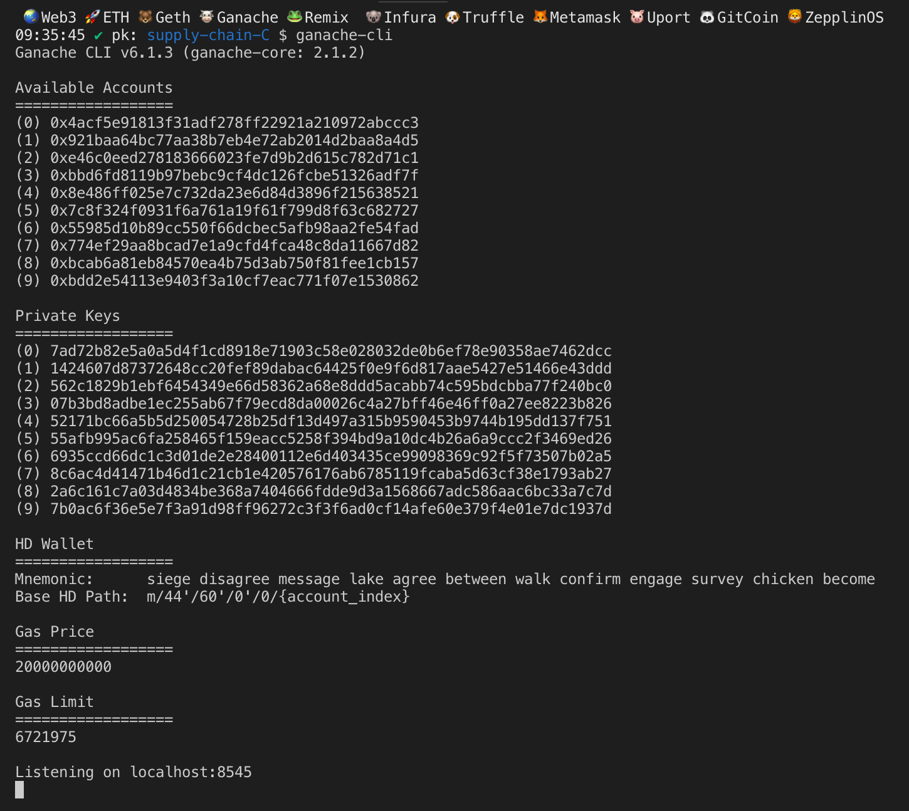

# Supply chain & data auditing

This repository containts an Ethereum DApp that demonstrates a basic Supply Chain flow between Farmer, Distributor, Retailer and Consumer.

The app allows a **farmer** to:
1. Harvest/add new items to the system.
2. Process, pack and sale these goods.


3. The **distributor** can buy and ship these items.
4. The **retailer** can mark items as received.
5. The **customer** can purchase them.


Search items by UPC:


A transaction history will be available to show the record of every transaction performed.


## Getting Started

These instructions will get you a copy of the project up and running on your local machine for development and testing purposes. See deployment for notes on how to deploy the project on a live system.

### Prerequisites

Please make sure you've already installed ganache-cli, Truffle and enabled MetaMask extension in your browser.

- ganache-cli: 6.4.4
- ganache-core: 2.5.6
- truffle: v4.1.14 (core: 4.1.14)
- Solidity: v0.4.24 (solc-js)
- Metamask: 6.7.3
- node: 8.9.4
- npm: 6.9.0
- lite-server: 2.4.0 

Checking versions in your command line:
```
$ ganache-cli --version
Ganache CLI v6.4.4 (ganache-core: 2.5.6)

$ truffle version
Truffle v4.1.14 (core: 4.1.14)
Solidity v0.4.24 (solc-js)

$ npm version
npm: '6.9.0',
node: '8.9.4',

```

### Installing

A step by step series of examples that tell you have to get a development env running

Clone this repository:

```
git clone https://github.com/jgongil/nautilus.git
```

Change directory to ```project-6``` folder and install all requisite npm packages (as listed in ```package.json```):

```
cd project-6
npm install
```

Launch Ganache:

```
ganache-cli -m "spirit supply whale amount human item harsh scare congress discover talent hamster"
```

Your terminal should look something like this:



In a separate terminal window, Compile smart contracts:

```
truffle compile
```

Your terminal should look something like this:


This will create the smart contract artifacts in folder ```build\contracts```.

Migrate smart contracts to the locally running blockchain, ganache-cli:

```
truffle migrate
```

Your terminal should look something like this:


Test smart contracts:

```
truffle test
```

All 11 tests should pass.


In a separate terminal window, launch the DApp:

```
npm run dev
```
## Deployment in Rinkeby

The below shows the transaction ID´s associated to every contract deployment along with the contract adress.

```
  Deploying FarmerRole...
  ... 0x34d88f5500b5766a85f1b707b40e6ee394fa9607866a295fcfbaf8cece3e3613
  FarmerRole: 0xc884790375d9b128ce3999f57c51405af0473aae
  Deploying DistributorRole...
  ... 0xfcc02130f80e032db73c53355df7777f33027679cc8c92ceeb4bb8cf6330a63b
  DistributorRole: 0x23449601965e62362b8de1ee64089e9000cbc636
  Deploying RetailerRole...
  ... 0x3190f29515d6182dbc92119bd298ada31ddf830d1da931198443fb6cc1dd5758
  RetailerRole: 0x41223ab9b582d9f69a2a6f245771a45e69645f39
  Deploying ConsumerRole...
  ... 0x8b32606a0d40517f2087e4c854e4f2b1cd9ad26b0eb9a477a0af3e2d0ff01f0e
  ConsumerRole: 0x828b4b0d19b6299ac2990506850fece48f5ca0e7
  Deploying SupplyChain...
  ... 0x13d3bf00d6f5759397a814f3fc1cc56a994d0d70dad7683a2e47b38d9220a667
  SupplyChain: 0x077f338c32407528ed064fa30e905fe41e556f44
Saving successful migration to network...
  ... 0xacbadbbf59bb092f1774e74de3edc84f36c924fc299e44dc59b400425929ebeb

```
## Design & Architecture

[write-up-UML](write-up-UML/write-up-UML.md)


## Built With

* [Ethereum](https://www.ethereum.org/) - Ethereum is a decentralized platform that runs smart contracts
* [IPFS](https://ipfs.io/) - IPFS is the Distributed Web | A peer-to-peer hypermedia protocol
to make the web faster, safer, and more open. [**Currently not used!!**]
* [Truffle Framework](http://truffleframework.com/) - Truffle is the most popular development framework for Ethereum with a mission to make your life a whole lot easier.


## Authors

See also the list of [contributors](https://github.com/your/project/contributors.md) who participated in this project.

## Acknowledgments

* Solidity
* Ganache-cli
* Truffle
* IPFS
